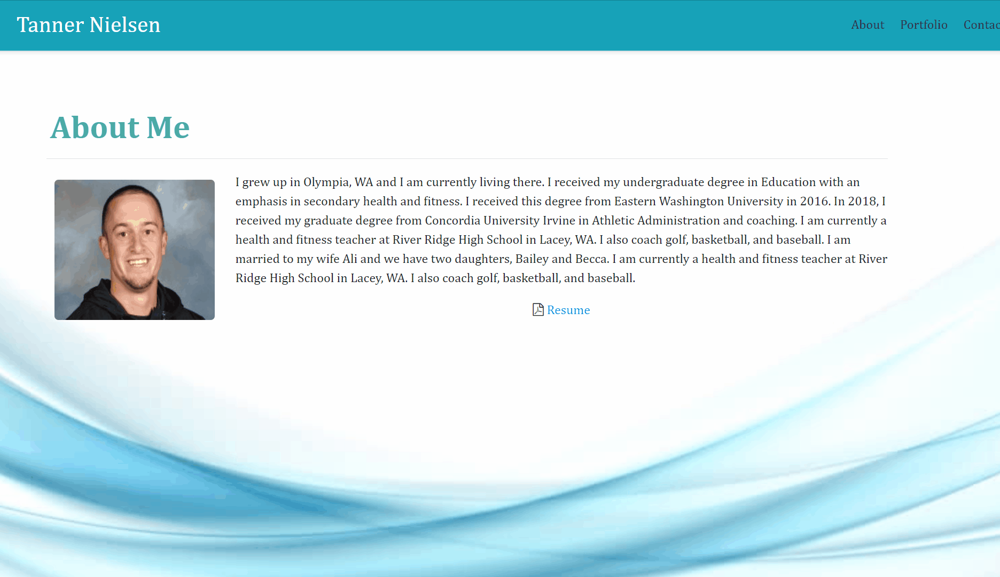
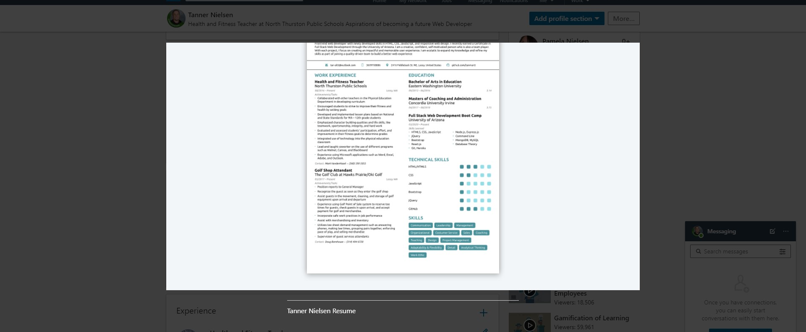

# HW2.CSS-Bootstrap Description
https://tanman5.github.io/HW2.CSS-Bootstrap/

For this homework assignment we were to update the portfolio, design and our GitHub/Linkedin profiles. Some of the minimum requirements include:

```
Updated portfolio featuring project 1 and two exemplary homework assignments.


Update GitHub profile with pinned repositories featuring project 1 and two exemplary assignments.


Updated resume


Updated LinkedIn profile
```

## Requirements Met

I updated the portfolio with our recent project we completed as a team.  I also updated the other four projects we could display in which I thought I did a exemplary job in.  I also updated my GitHub account along with my Linkedin profile.  I also uploaded my resume.

## Proof 



From the home page we can click the **linkedin** link that will open on a new tab





